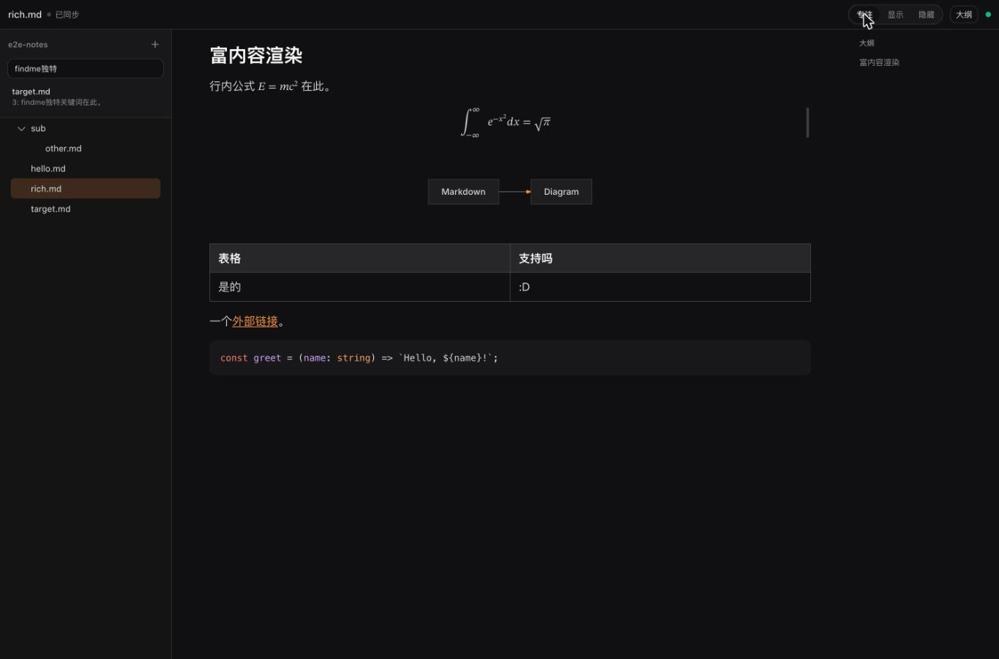

# mdopen

在浏览器里编辑本地 Markdown 文件。一条 `md` 命令，文件读写走本地常驻服务，浏览器端零权限弹窗；AI agent 改动实时同步进编辑器，保存自动排版。

Edit local Markdown files in your browser. One `md` command — a tiny local daemon does the file I/O (no browser permission prompts), external changes from AI agents sync in live, and every save is auto-formatted.



## 特性 / Features

- **`md file.md` / `md dir` 即开即用** — daemon 未启动会自动拉起 / auto-starts the daemon on first use
- **Typora 式所见即所得** — [Meowdown](https://github.com/prosekit/meowdown) 混合渲染，focus / show / hide 三种语法可见度 / hybrid WYSIWYG rendering
- **保存即格式化** — [autocorrect](https://github.com/huacnlee/autocorrect)（中英文空格）+ [oxfmt](https://github.com/oxc-project/oxfmt)（Markdown 排版），磁盘永远整洁，回灌不打断输入 / every save runs autocorrect + oxfmt; reflow never interrupts typing
- **与 AI agent 共同编辑** — 外部改动实时刷新；冲突时并排 diff 选边 / live sync with external edits, side-by-side diff on conflict
- **文件树 / 全文搜索（ripgrep）/ 大纲 / wikilink / 图片粘贴 / 暗色模式**
- **开机自启** — `md service install`（macOS launchd）

## 安装 / Install

需要 [Bun](https://bun.sh) ≥ 1.2；全文搜索需要 [ripgrep](https://github.com/BurntSushi/ripgrep)。Requires Bun ≥ 1.2; full-text search needs ripgrep.

```bash
bun add -g mdopen   # or: pnpm add -g mdopen
```

升级后无需手动重启：下次运行 `md` 时 CLI 发现常驻 daemon 版本不一致会自动重启它，已打开的页面自动重连。Upgrades are seamless — the next `md` run detects the version mismatch, restarts the daemon, and open tabs reconnect automatically.

```bash
bun add -g mdopen@latest   # upgrade
```

## 使用 / Usage

```bash
md notes.md               # 打开单个文件（工作区为其父目录）/ open a file
md ~/notes                # 打开目录 / open a directory
md                        # 恢复上次工作区 / reopen last workspace
md service install        # 开机自启 / start at login (launchd)
md service uninstall
```

端口默认 `2233`（`--port` / `MD_PORT` 覆盖），只监听 `127.0.0.1`。Default port `2233`, bound to `127.0.0.1` only.

## 开发 / Development

```bash
pnpm install
pnpm dev      # daemon (2233) + vite dev (5173)
pnpm test     # bun test（server e2e + web 单元测试）
pnpm lint     # oxlint
pnpm build    # tsc -b + vite build
```

架构与协议设计见 [DESIGN.md](./DESIGN.md)。Architecture and protocol live in [DESIGN.md](./DESIGN.md) (Chinese).

## License

[MIT](./LICENSE)
