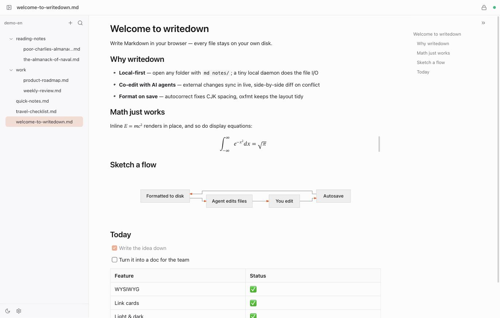

# writedown

English | [简体中文](./README_zh.md)

Edit local Markdown files in your browser. One `md` command — a tiny local daemon does the file I/O (no browser permission prompts), external changes from AI agents sync in live, and every save is auto-formatted.



## Features

- **Instant open** — `md file.md` / `md dir` auto-starts the daemon on first use
- **Typora-style WYSIWYG** — hybrid rendering by [Meowdown](https://github.com/prosekit/meowdown): syntax peeks out only where your cursor rests
- **Format on save** — [autocorrect](https://github.com/huacnlee/autocorrect) (CJK spacing) + [oxfmt](https://github.com/oxc-project/oxfmt) (Markdown layout); files on disk stay tidy, reflow never interrupts typing
- **Co-edit with AI agents** — external changes sync in live; side-by-side diff to pick a side on conflict
- **Rich link cards** — a YouTube / X / website URL on its own line renders as a player, tweet card, or site card, while the markdown stays a plain URL
- **File tree with inline create/rename, fuzzy filename filter, outline, wikilinks, image paste, settings panel, light & dark themes**
- **Start at login** — `md service install` (macOS launchd)

## Install

Requires [Bun](https://bun.sh) ≥ 1.2.

```bash
bun add -g writedown   # or: pnpm add -g writedown
```

Upgrades are seamless — the next `md` run detects the daemon version mismatch, restarts it, and open tabs reconnect automatically.

```bash
bun add -g writedown@latest   # upgrade
```

## Usage

```bash
md notes.md               # open a file (its folder becomes the workspace)
md ~/notes                # open a directory
md                        # reopen the last workspace
md service install        # start at login (launchd)
md service uninstall
```

Default port `2233` (override with `--port` / `MD_PORT`), bound to `127.0.0.1` only. Settings live in `~/.config/writedown/settings.json`, editable from the in-app settings dialog.

## Development

```bash
pnpm install
pnpm dev      # daemon (2233) + vite dev (5173)
pnpm test     # bun test (server e2e + web unit tests)
pnpm lint     # oxlint
pnpm build    # tsc -b + vite build
```

Architecture and protocol live in [DESIGN.md](./DESIGN.md) (Chinese).

## License

[MIT](./LICENSE)
