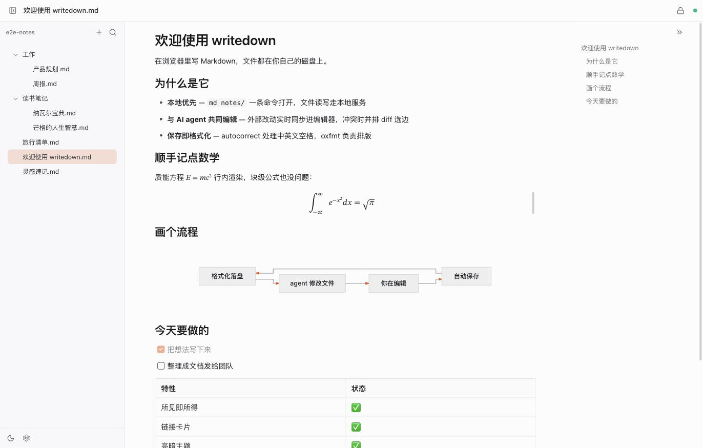

# writedown

[English](./README.md) | 简体中文

在浏览器里编辑本地 Markdown。一条 `md` 命令打开文件或目录：本地 daemon 负责读写，浏览器端没有权限弹窗；AI agent 的外部改动实时同步进编辑器，保存时自动排版。



## 特性

- 即开即用：`md file.md` 或 `md dir`，daemon 未启动时自动拉起
- 所见即所得：[Meowdown](https://github.com/prosekit/meowdown) 混合渲染，语法只在光标处露出
- 保存即格式化：[autocorrect](https://github.com/huacnlee/autocorrect) 处理中英文空格，[oxfmt](https://github.com/oxc-project/oxfmt) 负责排版，回灌不打断输入
- 与 AI agent 共同编辑：外部改动实时同步，冲突时并排 diff 选边
- 链接卡片：独占段落的 YouTube、X 或网站链接渲染为播放器、推文卡或站点卡片，文件中仍是纯 URL
- 文件树内联新建与重命名、文件名模糊过滤、大纲、wikilink、图片粘贴、设置面板、亮暗主题
- 开机自启：`md service install`（macOS launchd）

## 安装

需要 [Bun](https://bun.sh) ≥ 1.2。

```bash
bun add -g writedown   # 或 pnpm add -g writedown
```

升级（`bun add -g writedown@latest`）后无需手动重启：下次运行 `md` 时会自动重启 daemon，已打开的页面自动重连。

## 使用

```bash
md notes.md          # 打开文件，其父目录作为工作区
md ~/notes           # 打开目录
md                   # 恢复上次工作区
md service install   # 开机自启（launchd）
md service uninstall # 取消开机自启
```

- 端口默认 `2233`，可用 `--port` 或 `MD_PORT` 覆盖，只监听 `127.0.0.1`
- 配置位于 `~/.config/writedown/settings.json`，也可在应用内设置面板修改

## 开发

```bash
pnpm install
pnpm dev      # daemon（2233）+ Vite（5173）
pnpm test     # server e2e + web 单元测试
pnpm lint
pnpm build
```

架构与协议设计见 [DESIGN.md](./DESIGN.md)。

## 许可

[MIT](./LICENSE)
